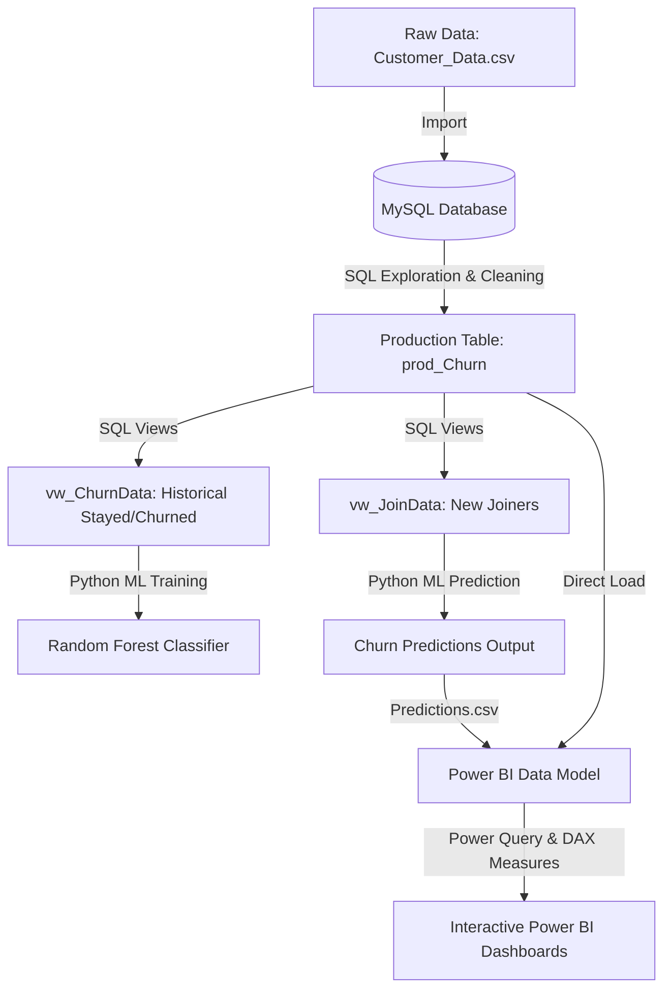

# 📊 Customer Churn Analysis & Predictive Modeling Project

An end-to-end data analysis and machine learning project focused on understanding customer churn, identifying key risk factors, and predicting future churners for subscription-based services. This project uses a hybrid tech stack featuring **MySQL** for data extraction and preprocessing, **Python (Random Forest)** for predictive analytics, and **Power BI** for interactive business intelligence dashboards.

---

## 🖥️ Dashboard Showcase

### 1. Churn Analysis - Summary Dashboard
Provides a comprehensive overview of historical churn rates, customer demographics, contract details, payment methods, and services used.


### 2. Churn Analysis - Prediction Dashboard
Leverages predictions from our Machine Learning model to profile new joiners who are at risk of churning, enabling proactive customer retention strategies.


---

## 📁 Repository Structure

```directory
├── Screenshots/
│   ├── Summary.PNG               # Screenshot of the Summary dashboard page
│   └── Prediction.PNG            # Screenshot of the Prediction dashboard page
├── Codes, Queries & DAX/
│   ├── SQL Queries.docx          # Word document containing all staging and production SQL queries
│   ├── Power Query Transformations & Measures.docx # Word document containing DAX formulas and Power Query logic
│   └── Random_Forest_DA.ipynb    # Colab Notebook containing python model training and prediction
├── Data/
│   ├── Customer_Data.csv         # Raw customer dataset
│   └── customer_data_query.sql   # SQL file containing table definitions and views creation
├── Customer_Churn_Analysis.pbix  # Power BI dashboard file
├── Predictions.csv               # Output file containing predicted churners from the Random Forest model
└── README.md                     # Project documentation
```

---

## ⚙️ Project Workflow & Architecture



### 1. Database Extraction & ETL (MySQL)
* Created database `db_churn` and imported raw customer data.
* Explored missing values and distinct categoricals across demographic features.
* Constructed a production table (`prod_Churn`) replacing `NULL` values in service columns with logical defaults (`None`, `No`, `Others`) using `IFNULL` functions.
* Created database views:
  * `vw_ChurnData`: Fetched historical customers with statuses `Churned` or `Stayed` to serve as the training set for our predictive model.
  * `vw_JoinData`: Fetched newly `Joined` customers to serve as the prediction target set.

### 2. Predictive Analytics & Machine Learning (Python)
* Built a **Random Forest Classifier** in a Colab Notebook using `scikit-learn` to classify whether a customer will churn (1) or stay (0).
* **Data Preprocessing**: Categorical features were encoded using `LabelEncoder`, and feature splitting was set at an 80/20 train/test split.
* **Model Evaluation**:
  * **Overall Accuracy**: **84%**
  * **Precision for Churners (Class 1)**: **80%**
  * **Recall for Churners (Class 1)**: **63%** (F1-Score: 70%)
* **Feature Importance**: Determined that factors like contract type, monthly charges, tenure, and internet service types were major predictors of customer churn.
* **Prediction**: Predicted churn risk for the 411 new joiners and exported 380 high-risk profiles into `Predictions.csv` for targeted marketing campaigns.

### 3. Data Modeling & Visualizations (Power Query & Power BI)
* Imported `prod_Churn` and `Predictions.csv` into Power BI.
* Used **Power Query** for schema modeling:
  * Created custom conditional columns: `Churn Status` (1 if Churned, 0 if Stayed/Joined).
  * Grouped `Monthly_Charge` into `Monthly Charge Range` ("< 20", "20-50", "50-100", "> 100").
  * Generated dedicated mapping tables (`mapping_AgeGrp`, `mapping_TenureGrp`) to organize age metrics into groups ("< 20", "20 - 35", "36 - 50", "> 50") along with sorting columns.
  * Created a reference table `mapping_TenureGrp` to group customer tenure into segments ("< 6 Months", "6-12 Months", etc.) along with sorting columns.
  * Created `prod_Services` by unpivoting services to analyze the churn rates of individual services (Fiber Optic, DSL, Cable, etc.).

---

## 📈 Key DAX Measures

To drive the dashboard visualizations, the following key DAX measures were implemented:

| Measure Name | DAX Formula | Description |
| :--- | :--- | :--- |
| **Total Customers** | `COUNT(prod_Churn[Customer_ID])` | Calculates the total count of customers in the system. |
| **New Joiners** | `CALCULATE(COUNT(prod_Churn[Customer_ID]), prod_Churn[Customer_Status] = "Joined")` | Counts newly registered customers. |
| **Total Churn** | `SUM(prod_Churn[Churn Status])` | Aggregates the number of customers who have churned. |
| **Churn Rate** | `[Total Churn] / [Total Customers]` | Calculates the percentage of historical customers lost. |
| **Count Predicted Churner** | `COUNT(Predictions[Customer_ID]) + 0` | Counts the new customers flagged at-risk by the ML model. |
| **Title Predicted Churners** | `"COUNT OF PREDICTED CHURNERS : " & COUNT(Predictions[Customer_ID])` | Dynamically updates the card title in the Prediction tab. |

---

## 🔍 Data Insights & Business Recommendations

Based on our interactive analysis, the following major findings were uncovered:

### 1. High Churn on Month-to-Month Contracts
* **Insight**: Customers on a **Month-to-Month contract** have a massive **46.53% churn rate**, compared to just **11.04%** for 1-year and **2.73%** for 2-year contract holders.
* **Recommendation**: Implement promotional discounts or loyalty incentives (e.g., "Save 10% by switching to an annual plan") to transition month-to-month subscribers into longer-term commitments.

### 2. Fiber Optic Services Issue
* **Insight**: Customers utilizing **Fiber Optic Internet** experience a churn rate of **41.10%**, which is significantly higher than DSL (19.37%) and Cable (25.72%).
* **Recommendation**: Perform technical quality audits on fiber optic lines and review competitor pricing in fiber-heavy regions. The high churn points to issues with service quality, reliability, or high price points.

### 3. Payment Method Risk
* **Insight**: Customers paying via **Bank Withdrawal (34.43% churn)** and **Mailed Check (37.82% churn)** are much more likely to churn compared to those on **Credit Card (14.00% churn)**.
* **Recommendation**: Introduce a small billing credit (e.g., $2 off monthly bills) for signing up for auto-pay via Credit Card. Credit cards reduce payment failures and make subscription renewals frictionless.

### 4. Competitor Threats
* **Insight**: The leading reason category for customer churn is **Competitor (761 customers lost)**, far exceeding attitude, price, or service dissatisfaction.
* **Recommendation**: Monitor competitor offers closely and design active counter-offers. Launching a winback team specialized in counter-matching competitor promotions is highly recommended.

### 5. At-Risk Profile of New Joiners
* **Insight**: Among the 411 new joiners, the ML model predicts **380 are at risk of churning**. Of these, **247 are female** and **133 are male**, mostly residing in Uttar Pradesh and Maharashtra.
* **Recommendation**: Deploy custom onboarding campaigns and welcome offers targeted at these specific demographics within the first 30 days to build brand affinity and reduce early churn.

---

## 🚀 How to Run and Reproduce

### 1. Database Setup
1. Execute the SQL queries located in `Data/customer_data_query.sql` inside your MySQL database client.
2. Ensure the raw dataset `Data/Customer_Data.csv` is correctly imported into a table named `customer_data`.
3. Verify that views `vw_ChurnData` and `vw_JoinData` are correctly created.

### 2. Run Python Predictions
1. **Prepare the input Excel file (`views_da.xlsx`)**: 
   Since the predictive model reads from a combined Excel sheet:
   * Export the database view `vw_ChurnData` to a sheet named `vw_churndata` in an Excel file.
   * Export the database view `vw_JoinData` to a sheet named `vw_joindata` in the same Excel file.
   * Name this Excel workbook `views_da.xlsx` and place it in your workspace.
2. **Configure File Path**:
   Open the notebook and change the `file_path` variable in the first cell from the Google Colab default (`r"/content/views_da.xlsx"`) to the local path where you saved `views_da.xlsx`.
3. **Install Dependencies**:
   Ensure Python 3 is installed along with the required libraries:
   ```bash
   pip install pandas numpy scikit-learn openpyxl joblib matplotlib seaborn
   ```
4. **Run the Notebook**:
   Execute the cells in `Random_Forest_DA.ipynb` to train the Random Forest model on historical data, evaluate its accuracy, and predict future churners from the new joiner list. The predictions will automatically be exported to `Predictions.csv` at the root of the project.

### 3. Visualizing in Power BI
1. Open the file `Customer_Churn_Analysis.pbix` in Power BI Desktop.
2. In the Home tab, click **Refresh** to reload the dataset from your SQL server (or local file paths if you mapped them differently).
3. The dashboards will update with the latest figures, predictions, and metrics.
